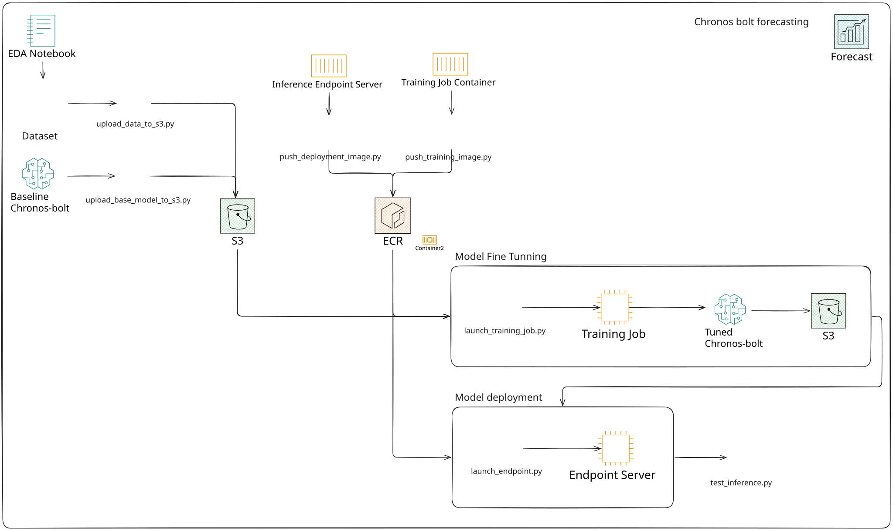

# Time Series Forecasting with Amazon SageMaker & Chronos

Production-ready pipeline for time series forecasting using Amazon SageMaker and [Chronos-bolt-tiny](https://huggingface.co/amazon/chronos-bolt-tiny).

Original Chronos repository: [amazon-science/chronos-forecasting](https://github.com/amazon-science/chronos-forecasting)

## Overview

End-to-end ML pipeline for time series prediction:

1. Data preparation and upload to S3
2. Model fine-tuning on SageMaker (AutoGluon + Chronos)
3. Model deployment as REST API endpoint
4. Local Docker-based inference (FastAPI + Uvicorn)
5. Model comparison and evaluation

## Model

[`amazon/chronos-bolt-tiny`](https://huggingface.co/amazon/chronos-bolt-tiny) - Lightweight transformer model for time series forecasting.

Features:
- Multivariate forecasting
- Missing value handling
- Temporal dependency capture
- Fast CPU inference

## Documentation

| Document | Description |
|----------|-------------|
| [Usage Guide](docs/USAGE.md) | Step-by-step workflow |
| [API Reference](docs/API.md) | Endpoints, request/response formats |
| [AWS Setup](docs/AWS_SETUP.md) | IAM, ECR, S3 configuration |
| [Local Development](docs/LOCAL_DEVELOPMENT.md) | Running locally with Docker |

## Architecture



## Configuration

All settings in `config.yaml`:

```yaml
s3:
  bucket: chronos-presmanes

sagemaker:
  training:
    limit_time: 300
    instance_type: ml.g4dn.xlarge
  inference:
    instance_type: ml.t2.medium
  endpoint_name: chronos-endpoint-prod
```

## TODO

- [x] EDA for testing base model locally
- [x] Training script with AutoGluon locally
- [x] Training job in SageMaker
- [x] Deploy model to SageMaker endpoint
- [x] Inference endpoint testing
- [ ] Streamlit app for user interaction